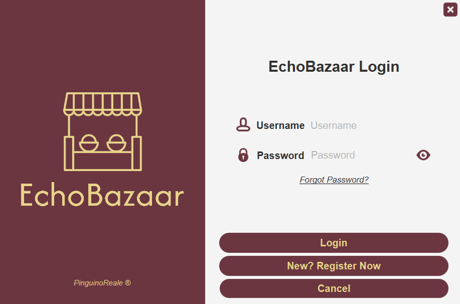
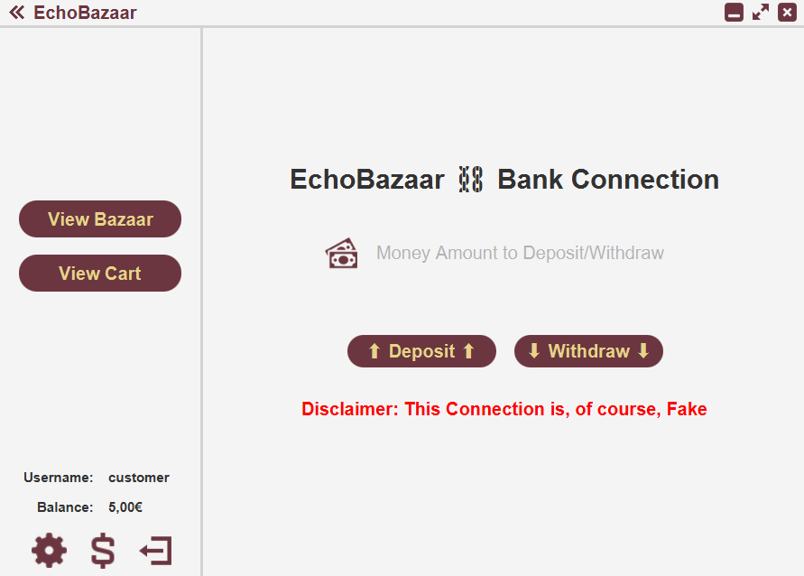
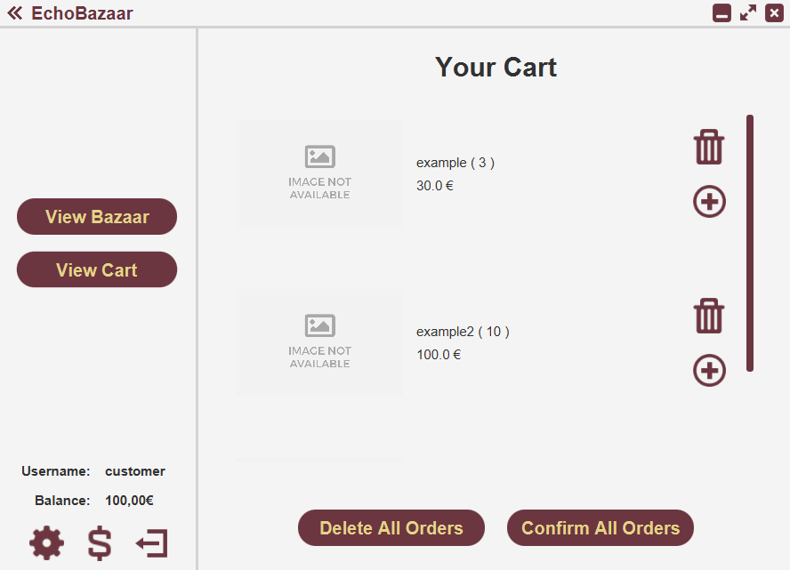

# EchoBazaar

EchoBazaar è stato concepito come un Software di Gestione generico che non doveva necessariamente salvare i dati su un database e, naturalmente, non doveva funzionare realmente (questo è solo un progetto scolastico, non una startup). Il gruppo di lavoro, composto da due persone, ha scelto di sviluppare un Software di Gestione che avrebbe permesso ai venditori di gestire il loro magazzino. Nel corso dello sviluppo, abbiamo deciso di trasformarlo in una Piattaforma di E-Commerce, dove i venditori potevano vendere i loro prodotti e i clienti potevano acquistarli.

## Indice
- [Avviso/Disclaimer](#avisodisclaimer)
- [Tecnologie](#tecnologie)
- [Come Eseguire il Progetto](#come-eseguire-il-progetto)
- [Funzionalità](#funzionalità)
- [Screenshot](#screenshot)
- [Autori](#autori)

## Avviso/Disclaimer
Questo progetto è stato sviluppato come progetto scolastico e non è destinato ad essere utilizzato in uno scenario reale. È stato sviluppato in un breve periodo di tempo e non è ottimizzato. Il codice non è pulito e non è destinato ad essere utilizzato come riferimento per le migliori pratiche. Il progetto è stato sviluppato solo a scopo educativo.

## Tecnologie
Il progetto è stato sviluppato utilizzando le seguenti tecnologie:
- Java
- JavaFX
- SceneBuilder
- CSS

## Come Eseguire il Progetto
Per eseguire il progetto, è necessario avere Java installato sul proprio computer. Se non lo hai, puoi scaricarlo [qui](https://www.java.com/it/download/manual.jsp). Questo progetto è stato sviluppato utilizzando Java 11, quindi è consigliato avere installata la stessa versione. Inoltre, devi avere JavaFX installato sul tuo computer. Se non lo hai, puoi scaricarlo [qui](https://gluonhq.com/products/javafx/). Dopo aver installato Java e JavaFX, puoi clonare questo repository e aprirlo nel tuo IDE preferito. Poi, puoi eseguire il file Main.java.

## Funzionalità
Il progetto ha le seguenti funzionalità:
### Funzionalità Comuni ai Venditori e ai Clienti
- Login
- Registrazione
- Reset Password (basato sull'ID privato dell'utente)
- Deposito/Prelievo di denaro dal conto dell'utente
- Modifica delle informazioni dell'utente (username e password)
- Eliminazione dell'account utente
### Funzionalità per i Venditori
- Registrazione dei Prodotti
- Gestione del Magazzino: Ricerca Prodotto, Modifica Prodotto, Rifornimento Prodotto
- Visualizzazione del "Bazar Globale" (tutti i prodotti di tutti gli altri venditori): Ricerca Prodotto, Visualizzazione Dettagli Prodotto
### Funzionalità per i Clienti
- Visualizzazione del "Bazar Globale" (tutti i prodotti di tutti i venditori): Ricerca Prodotto, Visualizzazione Dettagli Prodotto, Aggiunta Prodotto al Carrello
- Visualizzazione del Carrello: Rimozione Prodotto dal Carrello, Rimozione di Tutti i Prodotti dal Carrello, Acquisto Prodotti nel Carrello

### Funzionalità Speciale:
Quando un venditore registra un prodotto, può impostare il campo "autorestock" su true. Una volta che questo campo è true, il venditore è obbligato a compilare i campi "Stock Minimo", "Quantità di Rifornimento" e "ID Sorgente".

Questa funzionalità si basa sul concetto di Bazar, dove i venditori possono vendere i loro prodotti ad altri venditori, che poi li rivendono.

Supponiamo che il Venditore A abbia un prodotto X, e che un Venditore B abbia un prodotto Y, il quale ha il campo "autorestock" impostato su true, e che il prodotto Y abbia il campo "ID Sorgente" impostato sull'ID del prodotto X, una volta che il prodotto Y raggiunge lo "Stock Minimo", la quantità indicata nel campo "Quantità di Rifornimento" verrà acquistata dal prodotto X dal Venditore A e rifornita nel magazzino del Venditore B.

## Screenshot
### Login

### Registrazione

### Reset Password

### Deposito/Prelievo

### Modifica delle Informazioni dell'Utente

### Registrazione Prodotto

### Gestione del Magazzino

### Visualizzazione del "Bazar Globale" (Vista Venditore)

### Visualizzazione del "Bazar Globale" (Vista Cliente)

### Visualizzazione Carrello

## Autori
- [LorenBll](https://github.com/LorenBll) ;
- [Giovanni](https://github.com/ilcifa) .
