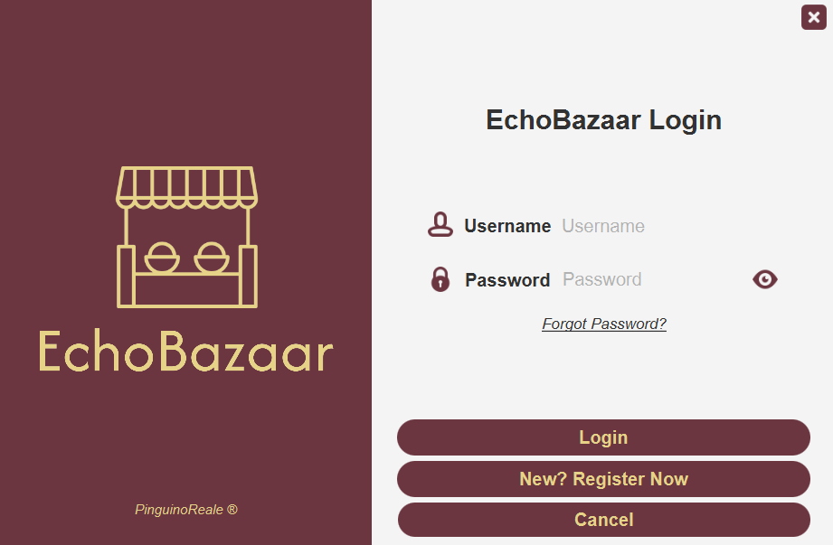
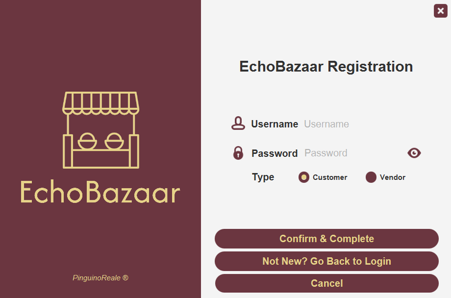
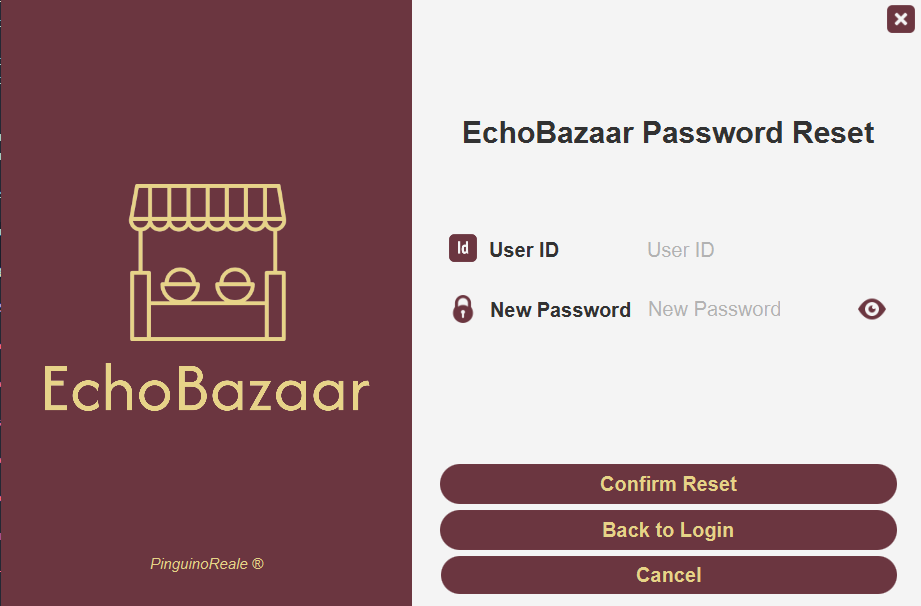
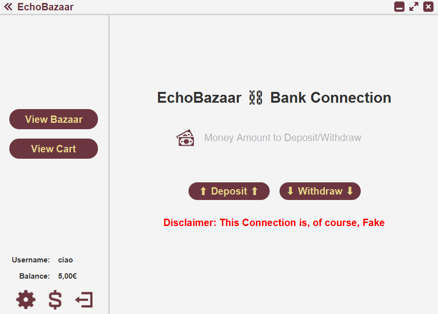
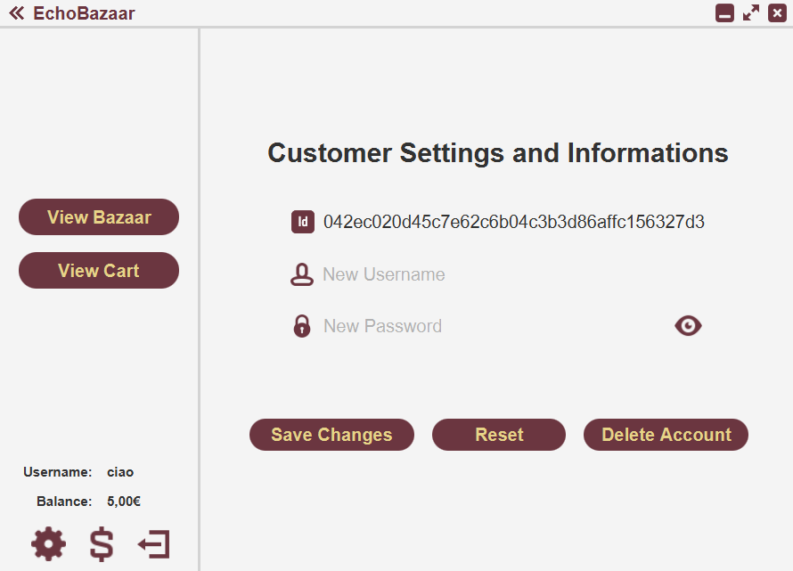
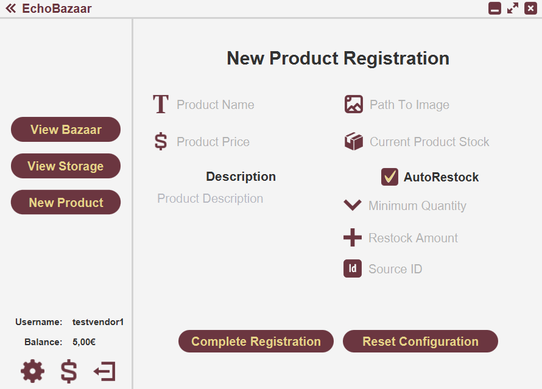
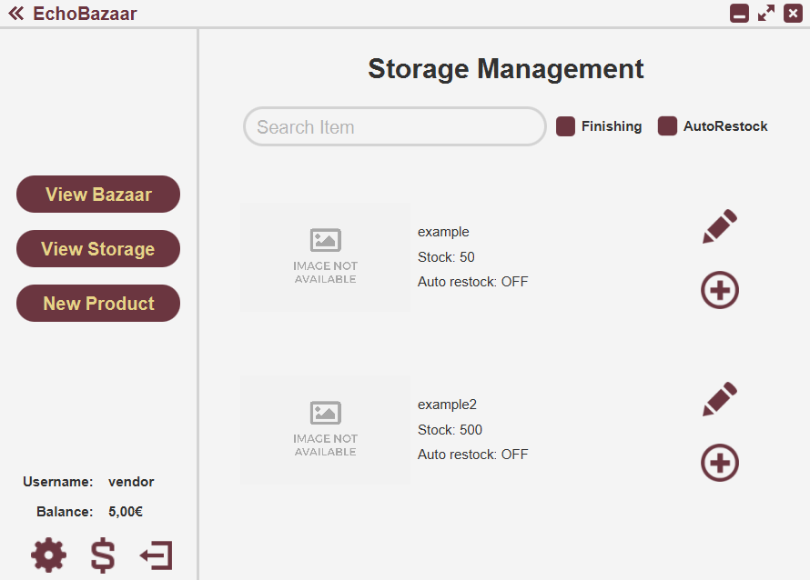
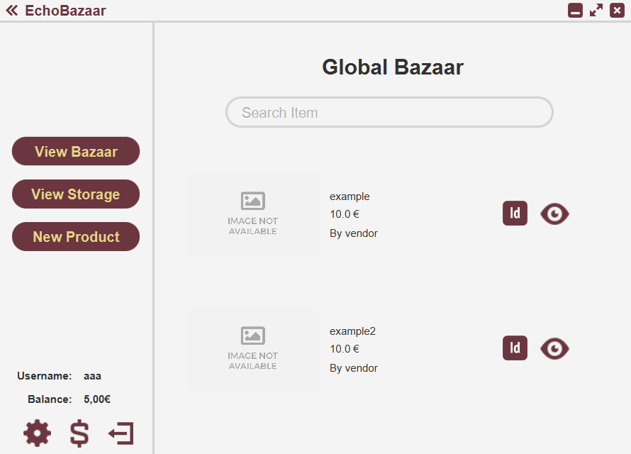
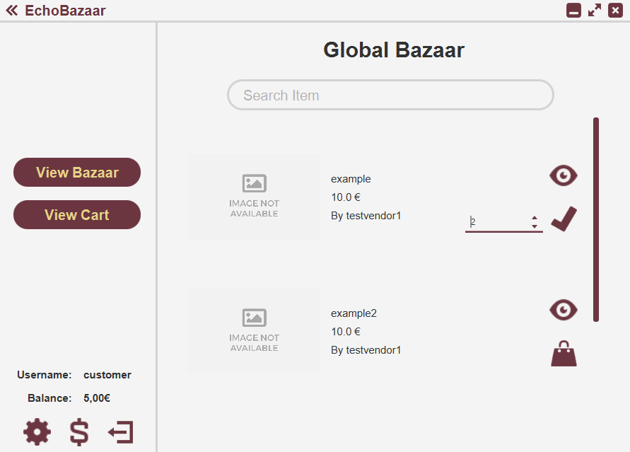
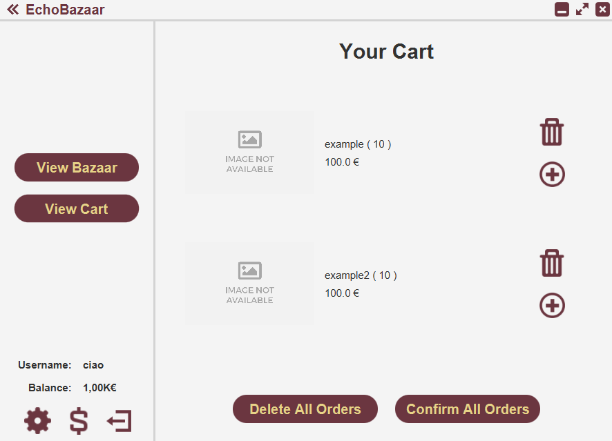

# EchoBazaar

JavaFX desktop application that combines vendor inventory management with customer shopping in a unified marketplace, featuring automated restocking and inter-vendor product sourcing.

## Table of contents

- [Why this project](#why-this-project)
- [Features](#features)
- [Tech stack](#tech-stack)
- [Project structure](#project-structure)
- [Installation](#installation)
- [Usage](#usage)
- [Screenshots](#screenshots)
- [Notes](#notes)
- [Developer](#developer)

## Why this project

Traditional inventory management systems often lack seamless integration between vendors and customers, making it difficult to create a unified marketplace where vendors can efficiently manage their storage while customers can easily discover and purchase products.

EchoBazaar solves this by providing a combined platform where vendors manage inventory and customers shop, with automated restocking, inter-vendor sourcing, and a shared "Global Bazaar" marketplace.

## Features

- Secure login with encrypted password storage
- Vendor and customer account registration
- Password reset via private ID verification
- Account management: username, password, and deletion
- Financial management: deposit and withdraw account balance
- Product registration with detailed specs and pricing
- Inventory search, modify, and restock
- Global Bazaar: browsable marketplace shared across all vendors
- Automated restocking with configurable minimum stock thresholds
- Inter-vendor trading: source products directly from other vendors
- Shopping cart with add, remove, and checkout
- Order processing with integrated payment

## Tech stack

- Java 21
- JavaFX
- FXML + CSS (MVC architecture)
- SceneBuilder

## Project structure

```text
.
├─ src/
│  └─ main/
│     ├─ java/
│     │  ├─ auth/                   # Password encryption
│     │  ├─ controllers/            # JavaFX MVC controllers
│     │  ├─ model/                  # Data models and business logic
│     │  │  └─ users/               # Vendor and Customer models
│     │  └─ Main.java               # Application entry point
│     └─ resources/
│        ├─ css/                    # UI stylesheets
│        ├─ data/                   # Persistent text-file storage
│        ├─ fxml/                   # FXML view layouts
│        └─ images/                 # Application icons and assets
├─ docs/
│  └─ images/                       # UI screenshots
├─ LICENSE
└─ README.md
```

The project follows a clean organizational structure:
- **src/main/java/**: Application source code organized by layer
- **src/main/resources/**: Runtime assets (layouts, styles, data, images)
- **docs/**: Documentation assets

## Installation

### Prerequisites

- Java 21 or newer ([Oracle](https://www.java.com/it/download/manual.jsp) or [OpenJDK](https://openjdk.org/))
- JavaFX runtime libraries ([Gluon](https://gluonhq.com/products/javafx/))
- A Java IDE (IntelliJ IDEA, Eclipse, or VS Code recommended)

### Quick start

1. Clone the repository:
   ```bash
   git clone https://github.com/LorenBll/EchoBazaar.git
   cd EchoBazaar
   ```

2. Open the project in your IDE

3. Configure the JavaFX SDK in your IDE's classpath/module path settings

4. Run `src/main/java/Main.java`

### Manual execution

1. Ensure Java 21 and JavaFX are configured in your system PATH

2. Add JavaFX libraries to the project classpath

3. Set the module path to include JavaFX modules

4. Run the application:
   ```bash
   java --module-path /path/to/javafx/lib --add-modules javafx.controls,javafx.fxml -cp out Main
   ```

## Usage

1. Launch the application via `Main.java`
2. Log in with existing credentials or register a new account
3. Vendors can register products, manage inventory, and configure automated restocking
4. Customers can browse the Global Bazaar, add items to cart, and complete purchases

## Screenshots





















## Notes

- This is a school project and is not intended for production use.
- Data is stored in plain text files under `src/main/resources/data/`.

## Developer

Created by [LorenBll](https://github.com/LorenBll)
