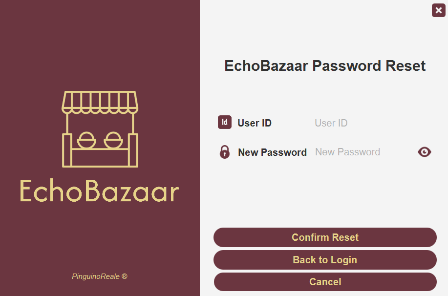
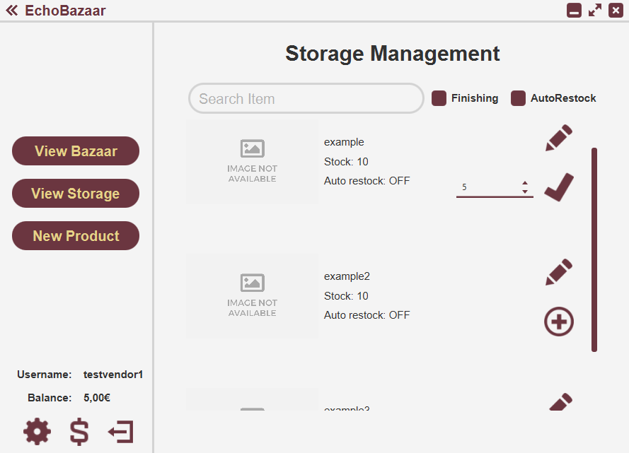

# EchoBazaar

EchoBazaar was asked to be a generic Management Software that didn't necessarily had to save data on a database and, of course, actually work (this is just a school project, not a startup). 
The working group, composed by two people, chose to develop a Management Software that would have allowed vendors to manage their storage. In course of the development, we decided to transform it into a E-Commerce Platform, where vendors could sell their products and customers could buy them.

## Table of Contents

- [Warning/Disclaimer](#warningdisclaimer)
- [Technologies](#technologies)
- [How to Execute the Project](#how-to-execute-the-project)
- [Features](#features)
- [Screenshots](#screenshots)
- [Authors](#authors)

## Warning/Disclaimer

This project was developed as a school project and it's not meant to be used in a real-world scenario. It was developed in a short period of time and it's not optimized. The code is not clean and it's not meant to be used as a reference for best practices. The project was developed for educational purposes only. 

Being italian, the comments in the code, the PowerPoint File (in the ./docs/ folder) and the Use Case Graph (always in the ./docs/) are written in italian.

## Technologies

The project was developed using the following technologies:
- Java
- JavaFX
- SceneBuilder
- CSS

## How to Execute the Project

To execute the project, you must have Java installed on your computer. If you don't have it, you can download it [here](https://www.java.com/it/download/manual.jsp). This project was developed using Java 21, so it's recommended to have the same version installed. Furthermore, you must have JavaFX installed on your computer. If you don't have it, you can download it [here](https://gluonhq.com/products/javafx/). After installing Java and JavaFX, you can clone this repository and open it in your favorite IDE. Then, you can run the Main.java file.

## Features

The project has the following features:

### Features Common to Vendors and Customers

- Login
- Register
- Password Reset (based on user's private ID)
- Deposit/Withdrawal of money from the user's account
- Modify user's information (username and password)
- Delete user's account

### Features for Vendors

- Product Registration
- Storage Management : Search Product , Modify Product , Restock Product
- View "Global Bazaar" (all products from all other vendors) : Search Product , View Product Details

### Features for Customers

- View "Global Bazaar" (all products from all vendors) : Search Product , View Product Details , Add Product to Cart
- View Cart : Remove Product from Cart , Remove All Products from Cart , Buy Products in Cart

### Special Feature:

When a vendor is registering a product he is allowed to set the field "autorestock" to true. Once this field is true the vendor is also forced to key in the fields of "Minimum Stock", "Restock Amount" and "Soruce ID".

This feature evolves around the concept of Bazaar, where vendors can sell their products to other vendors, that then sell it again.

Assuming that Vendor A has a product X, and that a Vendor B has a product Y, which has a field "autorestock" set to true, and that the product Y has a field "Source ID" set to the ID of the product X, once the product Y reaches the "Minimum Stock", the quantity indicated in the "Restock Amount" field will be bought of product X will be bought from Vendor A and restocked in Vendor B's storage.

## Screenshots

### Login

### Registration

### Password Reset

### Deposit/Withdrawal

### Modify User's Information

### Product Registration

### Storage Management

### "Global Bazaar" (Vendor) View

### "Global Bazaar" (Customer) View

### Cart View

## Author

- [LorenBll](https://github.com/LorenBll) .
