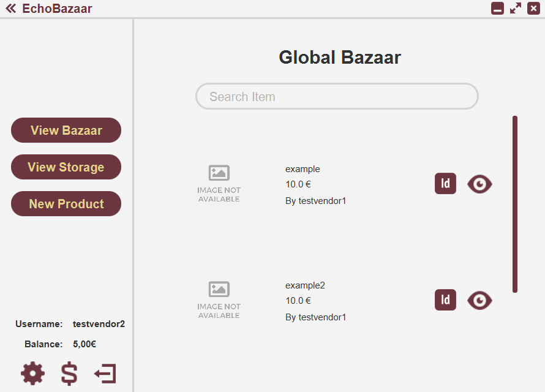

# EchoBazaar

**A JavaFX-based e-commerce platform enabling vendors to manage inventory and customers to purchase products with automated restocking capabilities**

## Problem & Solution

Traditional inventory management systems often lack seamless integration between vendors and customers, making it difficult to create a unified marketplace where vendors can efficiently manage their storage while customers can easily discover and purchase products.

**EchoBazaar** solves this problem by providing a comprehensive e-commerce platform that combines vendor inventory management with customer shopping capabilities, featuring automated restocking, inter-vendor product sourcing, and a unified "Global Bazaar" marketplace.

## Table of Contents

- [Warning](#warning)
- [Features](#features)
- [Screenshots](#screenshots)
- [Technologies](#technologies)
- [Installation](#installation)
- [Usage](#usage)
- [Developer](#developer)

## Warning

EchoBazaar is just a school project. While I am proud of the result, it is not meant to be actually used nor to be taken as an example in application of programming best practices.

## Features

### **User Authentication & Management**
- **Secure Login System**: User authentication with encrypted password storage
- **User Registration**: New vendor and customer account creation
- **Password Reset**: Account recovery using private ID verification
- **Account Management**: Modify username, password, and delete accounts
- **Financial Management**: Deposit and withdraw money from user accounts

### **Vendor Operations**
- **Product Registration**: Add new products with detailed specifications and pricing
- **Inventory Management**: Search, modify, and restock products in storage
- **Global Marketplace Access**: View and search products from other vendors
- **Automated Restocking**: Intelligent stock management with minimum thresholds and automatic reordering

### **Customer Experience**
- **Global Bazaar Shopping**: Browse and search products from all vendors
- **Product Details**: View comprehensive product information and specifications
- **Shopping Cart Management**: Add, remove, and purchase products with cart functionality
- **Order Processing**: Complete purchases with integrated payment system

### **Advanced Features**
- **Inter-Vendor Trading**: Vendors can automatically source products from other vendors
- **Smart Restocking**: Automated inventory replenishment based on minimum stock levels
- **Source ID Integration**: Link products to suppliers for seamless restocking workflow

## Screenshots

*User authentication interface with secure login functionality*

*New user registration form for vendors and customers*

*Account recovery system using private ID verification*

*Financial management interface for account balance operations*

*User profile management and account settings*

*Vendor interface for adding new products with automated restocking options*

*Comprehensive inventory management system for vendors*

*Vendor perspective of the global marketplace*

*Customer shopping interface with product browsing and selection*

*Shopping cart management and checkout system*

## Technologies

**Core Framework:**
- **Java 21** - Primary programming language and runtime environment
- **JavaFX** - Modern UI framework for desktop applications

**Development Tools:**
- **SceneBuilder** - Visual layout tool for FXML interface design
- **CSS** - Custom styling for enhanced user interface

**Architecture:**
- **MVC Pattern** - Model-View-Controller architecture for clean code organization
- **FXML** - Declarative UI markup for maintainable interface design

## Installation

### Prerequisites
- **Java 21** or higher installed on your system
- **JavaFX** runtime libraries
- Compatible IDE (IntelliJ IDEA, Eclipse, or VS Code recommended)

### Quick Setup
1. **Download Java 21**: Get the latest version from [Oracle](https://www.java.com/it/download/manual.jsp) or [OpenJDK](https://openjdk.org/)
2. **Install JavaFX**: Download from [Gluon](https://gluonhq.com/products/javafx/)
3. **Clone Repository**: `git clone https://github.com/LorenBll/EchoBazaar.git`
4. **Open in IDE**: Import the project into your preferred Java IDE
5. **Run Application**: Execute the `Main.java` file located in `src/main/java/`

### Manual Installation
1. Ensure Java and JavaFX are properly configured in your system PATH
2. Configure your IDE to include JavaFX libraries in the project classpath
3. Set up the module path to include JavaFX modules if using Java modules
4. Verify all dependencies are resolved before running the application

## Usage

### Starting the Application
1. Launch the application by running `Main.java`
2. The login screen will appear as the entry point
3. Choose to either log in with existing credentials or register a new account

### Key Features/Controls
- **Login**: Enter username and password to access your account
- **Registration**: Create new vendor or customer accounts with unique credentials
- **Password Reset**: Use your private ID to recover account access
- **Navigation**: Use the intuitive interface buttons to move between different sections

### Workflow

**For Vendors:**
1. Register/Login to your vendor account
2. Add products using the Product Registration feature
3. Manage inventory through the Storage Management system
4. Set up automated restocking with minimum stock thresholds
5. Browse the Global Bazaar to source products from other vendors

**For Customers:**
1. Register/Login to your customer account
2. Browse the Global Bazaar to discover products
3. Add desired items to your shopping cart
4. Complete purchases through the integrated checkout system
5. Manage your account balance for seamless transactions

### Tips
- **Automated Restocking**: Set `autorestock` to true when registering products to enable automatic inventory management
- **Inter-Vendor Trading**: Use Source IDs to link products for seamless restocking from other vendors
- **Account Management**: Regularly update your profile information and manage your account balance
- **Search Functionality**: Use the search features to quickly find specific products in the Global Bazaar

## Developer

Created by [LorenBll](https://github.com/LorenBll)

---

*This project was developed as an educational exercise to demonstrate JavaFX application development and e-commerce platform concepts. Italian comments and documentation reflect the developer's native language.*
